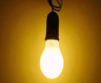

> Beri tanda lingkaran pada huruf jawaban a,b,c,d yang Saudara anggap benar.

 

1. **Jenis pengaman hubung singkat pada sirkit motor pompa hydrant atau spinkler adalah:**
    <ol type="A">
      <li style="color:red">Earth Leakage Circuit Breaker (ELCB) yang sangat peka terhadap arus ke bumi.</li>
      <li>Circuit Breaker (CB) dengan arus jatuh minimal 600%.</li>
      <li>Arrester Grounding, pengaman arus lebih pada beda potensial</li>
      <li>NH Fuse type class G dengan rating voltage 250 V s/d 600 V</li>
    </ol>

 

2. **Menurut ketentuan PUIL 2011 tegangan sentuh (AC) yang berbahaya adalah:**
    <ol type="A">
      <li style="color:red">Lebih dari 25 V, pada ruangan lembab.</li>
      <li>Kurang dari 50 V, pada ruangan lembab.</li>
      <li>Lebih dari 12 V, pada ruangan lembab.</li>
      <li>Kurang dari 120 V, pada ruangan lembab.</li>
    </ol> 

 

3. **Undang-undang keselamatan kerja dan standard K3 Listrik, yang pertama kali di berlakukan di negara Indonesia, adalah:**
    <ol type="A">
      <li>HO dan AVE 1938.</li>
      <li>VR 1910 dan AVE 1938.</li>
      <li style="color:red">UU No.1 Thn 1970 dan PUIL 1964</li>
      <li>PP No.1 , Tentang jawatan listrik Tahun 1945 dan PUIL 1964</li>
    </ol>

 

4. **Arus listrik dalam suatu rangkaian tertutup dengan tahanan yang terhubung seri, maka nilai arus masuk … arus keluar:**
    <ol type="A">
      <li>Lebih besar</li>
      <li>Lebih Kecil</li>
      <li style="color:red">Sama dengan</li>
      <li>Lebih kecil 50%</li>
    </ol>

  

5. **Yang dimaksud dengan saluran pentanahan TN-S Adalah:**
    <ol type="A">
      <li>TN-S=Terra Neutral Sensored, artinya kawat netral dan kawat pentanahan di sensor.</li>
      <li style="color:red">TN-S=Terra Neutral Separated, artinya kawat netral dan kawat pentanahan dipisah.</li>
      <li>TN-S=Terra Neutral Supplied, artinya kawat netral dan kawat pentanahan di supply (catu).</li>
      <li>TN-S=Terra Neutral Seried, artinya kawat netral dan kawat pentanahan disambung secara seri.</li>
    </ol>

 

6. **Bahaya listrik menurut _John Cadick_ dalam bukunya _“Electrical Safety Handbook”_ adalah:**
    <ol type="A">
      <li>Lightning, Electrostatic, Electricity leakage</li>
      <li style="color:red">Shock, Arc, Blast, dan other hazards.</li>
      <li>Sudden death, Electricity leakage, Fire.</li>
      <li>Short Cicuit, Alternating Current, Direct Current</li>
    </ol>

 

7. **Pengamanan instalasi listrik untuk mencegah terjadinya kebakaran seperti di bawah ini, Kecuali:**
    <ol type="A">
      <li>Pembumian instalasi listrik pada setiap panel listrik yang terpasang.</li>
      <li>Pemasangan pembatas arus pada setiap sirkit pembebanan listrik.</li>
      <li>Gunakan ELCB/RCBO/GPAS sesuai kapasitas terpasang.</li>
      <li style="color:red">Tempatkan APAR Co2 pada setiap panel listrik terpasang.</li>
    </ol>

 

8. **Tingkat kehandalan sebuah instalasi listrik ditentukan oleh:**
    <ol type="A">
      <li>Besarnya nilai tahanan isolasi.</li>
      <li style="color:red">Perencanaan sesuai dengan PUIL.</li>
      <li>Pemasangan sesuai gambar terencana.</li>
      <li>Penggunaan kualitas peralatan baik dan harga mahal.</li>
    </ol>

 

9. **Cara kerja Circuit Breaker dan Fuse adalah:**
    <ol type="A">
      <li>Kontak dari Circuit Breaker akan membuka jika ada gangguan listrik (berupa arus, tegangan, dan lain-lain) dan setelah itu kontak tidak dapat ditutup kembali apabila gangguan listriknya telah tidak ada. Sedangkan pada Fuse, elemen logam didalamnya akan melebur jika ada gangguan listrik (berupa arus, tegangan, dan lain-lain) dan Fuse tsb.harus diganti elemen logamnya saja.</li>
      <li>Kontak dari Circuit Breaker akan membuka jika ada gangguan listrik (berupa arus,tegangan, dan lain-lain) dan setelah itu kontak tidak dapat ditutup kembali apabila gangguan listriknya telah tidak ada. Sedangkan pada Fuse, elemen logam didalamnya akan melebur jika ada gangguan listrik (berupa arus, tegangan, dan lain-lain) dan Fuse tsb. harus diganti lengkap (tidak dianjurkan untuk mengganti elemen logamnya saja).</li>
      <li>Kontak dari Circuit Breaker akan membuka jika ada gangguan listrik (berupa arus, tegangan, dan lain-lain) dan setelah itu kontak dapat ditutup kembali apabila gangguan listriknya telah tidak ada. Sedangkan pada Fuse, elemen logam didalamnya akan melebur jika ada gangguan listrik  (berupa arus, tegangan, dan lain-lain) dan Fuse tsb. Harus diganti elemen logamnya saja.</li>
      <li style="color:red"><b>Kontak dari Circuit Breaker akan membuka</b> jika ada gangguan listrik (berupa arus, tegangan, dan lain-lain) dan setelah itu kontak dapat ditutup kembali apabila gangguan listriknya telah tidak ada. Sedangkan pada <b>Fuse, elemen logam didalamnya akan melebur</b> jika ada gangguan listrik (berupa arus, tegangan, dan lain-lain) dan Fuse tsb. Harus diganti lengkap (tidak dianjurkan untuk mengganti elemen logamnya saja).</li>
    </ol>

 

10. **Alat yang dipergunakan untuk menyelamatkan manusia dari bahaya “SHOCK =(tersengat listrik)” pada tegangan rendah adalah:**
    <ol type="A">
      <li style="color:red">ELCB, alias RCCB, alias GFCI, alias RCD, alias GPAS</li>
      <li>Circuit Breaker, alias Fuse, alias Sekering, alias Switchgear, alias Switchyard</li>
      <li>UPS, alias Charger, alias Rectifier, alias Diodes, alias Capacitor</li>
      <li>Slip ring, alias Exciter, alias PMG, alias PT, alias CT</li>
    </ol>

 

11. **Sensitivitas ELCB ditentukan sebesar 30 mA, karena apabila manusia teraliri arus sebesar 30 mA, maka berakibat:**
    <ol type="A">
      <li>Mulai terkejut atau tidak bisa mengendalikan kan diri sendiri</li>
      <li style="color:red">Mulai lengket atau mulai tidak bisa melepaskan diri sendiri  (Can not let go)</li>
      <li>Mulai terjatuh atau mulai tidak bisa berdiri lagi</li>
      <li>Mulai terjatuh atau mulai tidak bisa melepaskan diri sendiri (Can not let go)</li>
    </ol>

 

12. **Instalasi penyalur petir konvensional harus dilengkapi dengan pembumian sekurang-kurangnya adalah:**
    <ol type="A">
      <li>1(satu) buah penurunan /down conductor dan 2(dua) buah pembumian/grounding rod.</li>
      <li style="color:red">2(dua) buah penurunan / down conductor dan 2(dua) buah pembumian/grounding rod.</li>
      <li>3(tiga) buah penurunan / down conductor dan 3(tiga) buah pembumian/grounding rod.</li>
      <li>1(satu) buah penurunan / down conductor dan 2(dua) buah pembumian/grounding rod.</li>
    </ol>

 

13. <b>Dalam teori Segitiga Api (Fire Triangle), Api akan muncul apabila ada Oxigen, Fuel, dan Heat, masing-masing dalam jumlah yang cukup.Dalam sistem tenaga listrik, “HEAT” bisa timbul karena:</b>
    <ul>
      <li>Terjadi short circuit, tetapi alat proteksi tidak mentripkan cicuit</li>
      <li>Kualitas kabel (kawat dan isolasi) tidak baik</li>
      <li>Penggunaan jenis kabel yang salah (misalnya NYM hanya untuk indoor).</li>
      <li>Ukuran kawat terlalu kecil</li>
      <li>Terjadi “loss connection” (dari sambungan kawat, tusuk kontak yang bertumpuk-tumpuk yang cenderung tidak rapat, dan lain-lain) </li>
    </ul>
    
Pernyataan tersebut diatas:

      <ol type="A">
        <li>Sebagian salah</li>
        <li>Sebagian benar</li>
        <li>Semuanya salah</li>
        <li style="color:red">Semuanya benar</li>
      </ol>

 

14. **Bahaya Blast(ledakan) pada listrik, terdiri dari:**

    <ol type="A">
      <li style="color:red">Blast yang berasal dari equipment yang pemeliharaannya kurang baik, misalnya Tranformator meledak Battery meledak dan lain-lain, serta Blast yang terjadi karena Interrupting Rating (Breaking Capacity) yang tidak benar pada CB & Fuse.</li>
      <li>Blast yang berasal dari equipment baru, misalnya tranformator meledak battery meledak dan lain-lain, serta blast yang terjadi karena Interrupting Rating (Breaking Capacity) yang tidak benar pada CB & Fuse.</li>
      <li>Blast yang berasal dari equipment yang pemeliharaannya bagus, misalnya Tranformator meledak Battery meledak dan lain-lain, serta Blast yang terjadi karena Interrupting Rating (Breaking Capacity) yang tidak benar pada CB & Fuse.</li>
      <li>Blast yang berasal dari equipment dari pabrik lain , misalnya Tranformator meledak Battery meledak Dan lain-lain, serta Blast yang terjadi karena Interrupting Rating (Breaking Capacity) yang tidak benar pada CB & Fuse.</li>
    </ol>

 

15.  **Berikut ini adalah cara mencegah blast yang berasal dari equipment yang pemeliharaannya kurang baik:**
      <ol type="1">
        <li>Laksanakan pekerjaan Pemeliharaan (PM, PdM, dan CM) sesuai dengan prosedur-prosedur pemeliharaan (Maintenance Prosedures).</li>
        <li>Lakukan JSA (Job Safety Analysis) untuk setiap pekerjaan Pemeliharaan (PM, PdM, CM)</li>
      </ol>
      
<b>Pernyataan tersebut diatas:</b>
      <ol type="A">
        <li>Sebagian salah</li>
        <li>Sebagian benar</li>
        <li>Semuanya salah</li>
        <li style="color:red">Semuanya benar</li>
      </ol>
      

 
 

16. **Yang dimaksud bahaya-bahaya lain dari listrik adalah bahaya-bahaya yang selain Shock,Arc & Blast:**
    <ul>
      <li>Bahaya Induksi Electromagnetic ketika sedang melakukan pekerjaan pemeliharaan listrik</li>
      <li>
        Bahaya radiasi ketika sedang melakukan pekerjaan pemeliharaan listrik
        Bahaya terpeleset ketika sedang melakukan pekerjaan pemeliharaan listrik
        Bahaya jatuh dari ketinggian ketika sedang melakukan pekerjaan pemeliharaan listrik
      </li>
      <li>Bahaya tersentuh panas pada peralatan listrik ketika sedang melakukan pekerjaan pemeliharaan listrik dan lain-lain</li>
    </ul>
    
<b>Pernyataan tersebut diatas:</b>
      <ol type="A">
        <li>Semuanya salah</li>
        <li style="color:red">Semuanya benar</li>
        <li>Sebagian salah</li>
        <li>Sebagian benar</li>
      </ol>
    

 

17. **Cara mencegah bahaya-bahaya lain dari listrik adalah bahaya-bahaya yang selain Shock, Arc & Blast adalah:**
    <ol type="A">
      <li style="color:red">Hati-hati, Hindari Unsafe Condition & Unsafe Acts, Gunakan APD yang tepat dan baik, Patuhi rambu-rambu yang dipasang, Patuhi prinsip-prinsip K3 Umum, dan K3 Spesialis.</li>
      <li>Hati-hati, Hindari Unsafe Condition & Unsafe Acts.</li>
      <li>Gunakan APD yang tepat dan baik, Patuhi rambu-rambu yang dipasang, Patuhi prinsip prinsip K3 Umum dan K3 Spesialis.</li>
      <li>Patuhi rambu-rambu yang dipasang, Patuhi prinsip-prinsip K3 Umum,dan K3 Spesialis.</li>
    </ol>

 

18. **CHECK LIST pemeriksaan dan dan pengawasan persyaratan K3 alat-alat uji listrik dalam hal Insulation(isolasi) yang sangat berkaitan dengan terjadinya Short Circuit yang menyebabkan Shock, Arc & Blast. Teknologi kesatu (paling awal) adalah dengan menggunakan Insulation Resistance Tester (Meger): Untuk Tegangan Rendah s/d Tegangan Menengah. Rule of Thumb: Insulation Resistance minimum = 1000 Ohm/Volt. Aplikasi didunia industri seringkali + 1 MOhm, sehingga menjadi (kV operasi isolasi) + 1 MOhm. Jika tegangan operasi kabel berisolasi 220 Volt, maka Insulation Resistance minimum adalah:**
      <ol type="A">
        <li>= 1,21 Mohm.</li>
        <li style="color:red">= 1,22 Mohm.</li>
        <li>= 1,23 Mohm.</li>
        <li>= 1,24 Mohm.</li>
      </ol>

 

19. **Insulation Resistance Test merupakan:**
      <ol type="A">
        <li>“Indication Test”</li>
        <li>“Measurement Test”</li>
        <li>“Information Test”</li>
        <li style="color:red">“Go or No Go Test”</li>
      </ol>

 

20. **Teknologi kedua adalah “Polarization Index(P.I) Test”: Khusus untuk equipment yang ada winding-nya, misalnya Motor, Generator, Transformator, dll, dan untuk tegangan rendah s/d tegangan menengah. Hasilnya:**
    <ul>
      <li>< 1.0 = Bahaya</li>
      <li>1.0 - 1.4 = Jelek</li>
      <li>1.5 - 1.9 = Bisa dipertanyakan</li>
      <li>2.0 – 2.9 = Lumayan</li>
      <li>3.0 – 4.0 = Bagus</li>
      <li>> 4.0 = Sangat bagus</li>
    </ul>
    <dev>Jika hasil pengukuran PI pada winding Transformator adalah = 1,3, berarti:
    <ol type="A">
      <li>Winding pada Transformator tersebut sangat kotor dan sangat terkontaminasi.</li>
      <li style="color:red">Winding pada Transformator tersebut lembab, kotor dan terkontaminasi.</li>
      <li>Winding pada Transformator tersebut agak kotor atau agak bersih dari kotoran kontaminasi.</li>
      <li>Winding pada Transformator tersebut bersih atau sangat bersih dari kotoran .kontaminasi.</li>
    </ol>
    </dev>

 

21. **Sesuai PUIL 2011 ketentuan 510.5.3.1 halaman 400 dari 639 dan Tabel K.52 3..4 pada PUIL 2011 Amademen 1 tahun 2013, halaman 121 dari 154, Kabel NYM yang akan digunakan pada motor tersebut diatas adalah (upaya lebih aman, ukuran kawat dinaikkan satu step):**
      <ol type="A">
        <li>Berukuran 6 mm2.</li>
        <li>Berukuran 4 mm2.</li>
        <li style="color:red">Berukuran 2,5 mm2.</li>
        <li>Berukuran 1,5 mm2.</li>
      </ol>

 

22. **Yang dimaksudkan sebagai Mesin Listrik dalam Pemanfaatan adalah:**
    <ol type="A">
      <li style="color:red">Transformator Satu Fasa, Transformator Tiga Fasa, Transformator Khusus (Autotransformator, Transformator Pengukuran), Generator Arus Searah, Motor Arus Searah, Motor Induksi Tiga Fasa, Generator Sinkron, Motor Sinkron, Motor Satu Fasa, Generator Set.</li>
      <li>Transformator Arus, Transformator Potensial, Transformator Khusus (Autotransformator, Transformator Pengukuran), Generator Arus Searah, Motor Arus Searah, Motor Induksi Tiga Fasa, Generator Sinkron, Motor Sinkron, Motor Satu Fasa, Generator PLTD.</li>
      <li>Transformator Frekwensi tetap, Transformator Tiga Fasa, Transformator Khusus  (Autotransformator, Transformator Pengukuran), Generator Arus Searah, Motor Arus Searah, Motor Induksi Tiga Fasa, Generator Sinkron, Motor Sinkron, Motor Satu Fasa, Generator PLTU.</li>
      <li>Transformator Auto, Transformator Tiga Fasa, Transformator Khusus (Autotransformator, Transformator Pengukuran), Generator Arus Searah, Motor Arus Searah, Motor Induksi Tiga Fasa, Generator Sinkron, Motor Sinkron, Motor Satu Fasa, Generator PLTG</li>
    </ol>

 

23. **Agar mata kita tetap sehat maka tingkat pencahayaan (lux) untuk Ruang kerja di Perkantoran adalah :**
      <ol type="A">
        <li>150 lux</li>
        <li>250 lux</li>
        <li>300 lux</li>
        <li style="color:red">350 lux</li>
      </ol>

 

24. **Objek pemeliharaan di pemanfaatan adalah:**
      <ol type="A">
        <li style="color:red">Instalasi Listrik, Peralatan Listrik Rumah Tangga, Sistem Pengendalian, Mesin Listrik, Programmable logic Controller (PLC).</li>
        <li>Instalasi Listrik, Peralatan Listrik Rumah Tangga, Sistem Pengendalian, Mesin Listrik, Power Carrier Line (PLC).</li>
        <li>Instalasi Listrik, Peralatan Listrik Rumah Tangga, Sistem Pengendalian, Mesin Listrik, Professional Logic Controller (PLC).</li>
        <li>Instalasi Listrik, Peralatan Listrik Rumah Tangga, Sistem Pengendalian, Mesin Listrik, Proporsional Logic Controller (PLC).</li>
      </ol>

 

25. **Cara mencegah *blast* yang terjadi karena *Interrupting Rating* yang tidak benar pada *CB & Fuse*, adalah:**
      <ul>
        <li>Hindari kemungkinan terjadinya short circuit</li>
        <li>Pastikan Breaking Capacity dari Fuse dan Circuit Breaker adalah lebih besar daripada Maximum Short Circuit pada titik terjadinya short circuit tersebut. Maximum Short Circuit pada setiap titik Bus dihitung menggunakan software misalnya ETAP  (Electrical Transient Analizer Program), atau dengan menggunakan Tabel seperti contoh dari PLN.</li>
      </ul>
      <dev>
        <b>Pernyataan tersebut diatas:</b>
        <ol type="A">
          <li>Semuanya salah</li>
          <li style="color:red">Semuanya benar</li>
          <li>Sebagian salah</li>
          <li>Sebagian benar</li>
        </ol>
      </dev>

 

26. **Kita telah mengetahui bahwa Sensitivitas ELCB untuk menyelamatkan manusia dari bahaya SHOCK(tersengat listrik) adalah 30 mA. Berapa milidetik ELCB tersebut akan trip memutuskan aliran listrik ? *[Gunakan Kurva Arus mengalir ketubuh (mA)-vs-Waktu(mS)]***
    <ol type="A">
      <li>10 milidetik</li>
      <li style="color:red">20 milidetik</li>
      <li>30 milidetik</li>
      <li>40 milidetik</li>
    </ol>

 

27. **UPS (Uninterruptible Power Supply) merupakan salah satu peralatan elektronik yang ada di Pembangkitan listrik, yaitu juga merupakan peralatan:**
    <ol type="A">
      <li>Yang digunakan untuk catu daya beban-beban yang normal sebagaimana biasa sehingga suplai boleh terputus atau lampu boleh berkedip.</li>
      <li style="color:red">Yang digunakan untuk catu daya beban-beban yang sangat penting sehingga tidak boleh suplai listrik terputus atau lampu tidak boleh berkedip.</li>
      <li>Yang digunakan untuk kebutuhan listrik di sekolah-sekolah SMK dan SMA di Jakarta sehingga para siswanya bisa belajar dengan baik.</li>
      <li>Yang digunakan untuk kebutuhan listrik di pusat-pusat perbelanjaan dan perdagangan sehingga kegiatan ekonomi bisa berjalan dengan baik.</li>
    </ol>

 

28. **Dibandingkan dengan saluran bawah tanah (Underground), maka keuntungan saluran udara (Overhead) antara lain adalah:**
    <ol type="A">
      <li>Biaya investasi lebih mahal, Biaya Pemeliharaan lebih murah, Cara pemeliharaan lebih mudah, Cocok untuk daerah yang sering banjir.</li>
      <li>Biaya investasi lebih murah, Biaya Pemeliharaan lebih mahal, Cara pemeliharaan lebih mudah, Cocok untuk daerah yang sering banjir.</li>
      <li style="color:red">Biaya investasi lebih murah, Biaya Pemeliharaan lebih murah, Cara pemeliharaan lebih mudah, Cocok untuk daerah yang sering banjir.</li>
      <li>Biaya investasi lebih murah, Biaya Pemeliharaan lebih murah, Cara pemeliharaan lebih sulit, Cocok untuk daerah yang sering banjir.</li>
    </ol>

 

29. **Identifikasi potensi bahaya listrik:**
    <ol type="A">
      <li  style="color:red">Senada dengan cara pencegahan bahaya listrik</li>
      <li>Berlawanan dengan Cara pencegahan bahaya listrik</li>
      <li>Tidak terlalu penting</li>
      <li>Bisa dilakukan oleh siapa saja</li>
    </ol>

 

30. **Cara melakukan pertolongan pertama pada kecelakaan listrik adalah:**
    <ul>
      <li>Prinsipnya adalah upaya penyelamatan korban sehinggan korban harus dipisahkan dari aliran listrik dengan cara yang aman sebelum dilakukan pertolongan pertama.</li>
      <li>Segera hubungi bagian medis yang berwenang untuk datang kelokasi kecelakaan.</li>
      <li>Bagi yang sudah terlatih dapat melakukan Pertolonga pertama, misalnya resisutasi jantung dan/ atau nafas buatan.</li>
    </ul>
    <dev>
      <b>Pernyataan tersebut:</b>
      <ol type="A">
        <li style="color:red">Semuanya benar</li>
        <li>Semuanya salah</li>
        <li>Sebagian benar</li>
        <li>Perlu dikaji ulang</li>
      </ol>
    </dev>

 

31. **Fungsi dari *Transformator Daya(Trafo)*, adalah:**
    <ol type="A">
      <li style="color:red">Menaikan atau menurunkan Tegangan Listrik.</li>
      <li>Mentransformasikan Arus Listrik.</li>
      <li>Mentransformasikan Tegangan dan Arus Listrik (Daya).</li>
      <li>Menaikan dan menurunkan arus Listrik.</li>
    </ol>

 

32.  **Menurut penerapan level tegangan listrik yang berlaku di Indonesia, yang termasuk level Tegangan Tinggi adalah tegangan:**
      <ol type="A">
        <li style="color:red">150 KV</li>
        <li>20 KV</li>
        <li>220 V</li>
        <li>380 V</li>
      </ol>

 

33. **Fungsi Grounding Pentanahan yang terpasang pada instalasi di kaki tiang Transmisi adalah:**
    <ol type="A">
      <li>Penguat kaki tower</li>
      <li>Penguat pondasi peralatan listrik</li>
      <li>Agar tanahnya tidak mudah longsor</li>
      <li  style="color:red">Pengaman terhadap sambaran petir</li>
    </ol>

 

34. **Peralatan tegangan tinggi yg berfungsi sebagai saklar yg dapat membuka atau menutup rangkaian listrik dalam keadaan berbeban atau gangguan, adalah:**
    <ol type="A">
      <li>Pemisah (PMS)</li>
      <li  style="color:red">Pemutus Tenaga (PMT) /Circuit Breaker (CB)</li>
      <li>Load Break Switch (LBS)</li>
      <li>Sekering (Fuse)</li>
    </ol>

 

35. **Konduktor kawat penghantar  yg akan dipasang pada Instalasi harus memiliki salah satu sifat, yaitu:**
    <ol type="A">
      <li>Resitivitas tinggi</li>
      <li>Inductivitas tinggi</li>
      <li>Capasitansi tinggi</li>
      <li style="color:red">Konduktivitas tinggi</li>
    </ol>

 

36.  **Metoda Pemeliharaan peralatan tenaga listrik yang berdasarkan pada kondisi adalah jenis metode:**
      <ol type="A">
        <li>Preventive Maintenance</li>
        <li style="color:red">Predictive Maintenance</li>
        <li>Corrective Maintenance</li>
        <li>Rutine Maintenance</li>
      </ol>

 

37. **Berikut ini yang bukan termasuk sumber energi alternatif adalah...**
    <ol class="A">
      <li>Angin</li>
      <li style="color:red">Bensin</li>
      <li>Matahari</li>
      <li>Air</li>
    </ol>

 

38. **Di daerah pedesaan banyak dijumpai alat yang diletakkan di aliran sungai dan berfungsi menghasilkan sumber listrik. Alat tersebut adalah...**
      <ol type="A">
        <li>Kincir air</li>
        <li style="color:red">Kincir angin</li>
        <li>Dam</li>
        <li>Turbin</li>
      </ol>

 

39. **Matahari bisa dimanfaatkan manusia sebagai pembangkit listrik, hal tersebut dikenal dengan …**
    <ol type="A">
      <li>Pembangkit listrik tenaga sinar </li>
      <li style="color:red">Pembangkit listrik tenaga solar</li>
      <li>Pembangkit listrik tenaga surya</li>
      <li>Pembangkit listrik tenaga sunset</li>
    </ol>

 

40. **Perubahan energi yang terjadi pada gambar tersebut adalah ...**
    <ol type="A">
      <li>Energi listrik menjadi energi kimia</li>
      <li>Energi listrik menjadi energi gerak</li>
      <li>Energi listrik menjadi energi panas</li>
      <li style="color:red">Energi listrik menjadi energi cahaya</li>
    </ol>